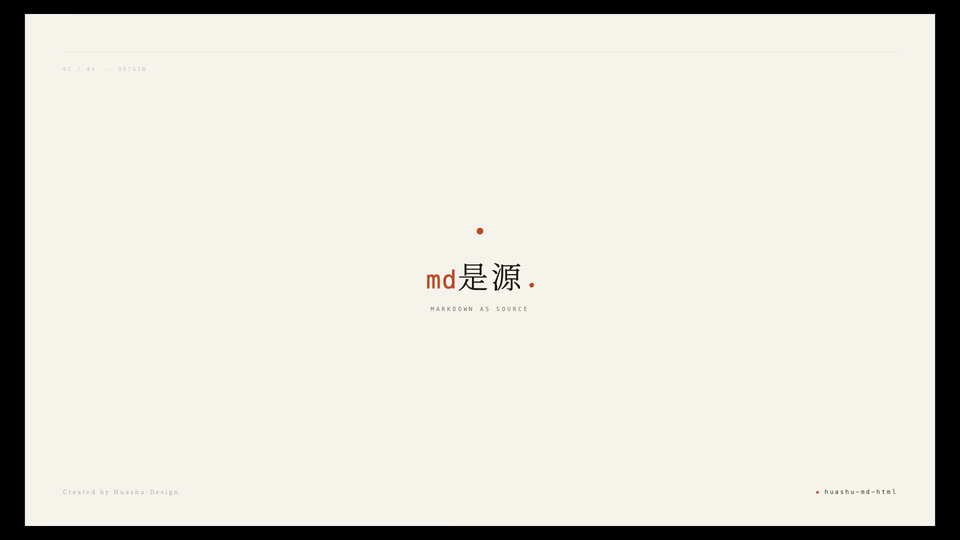
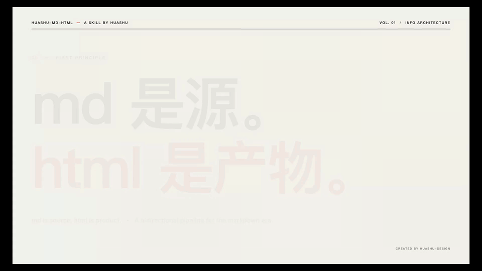
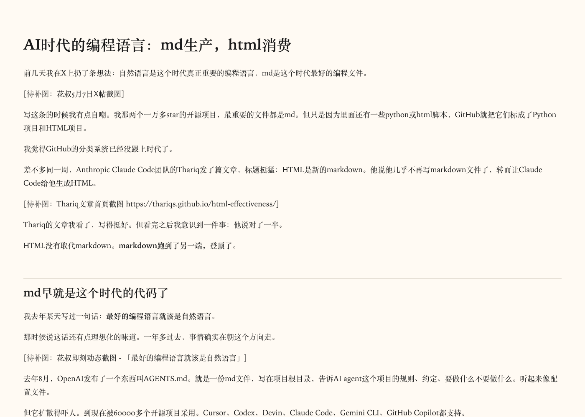
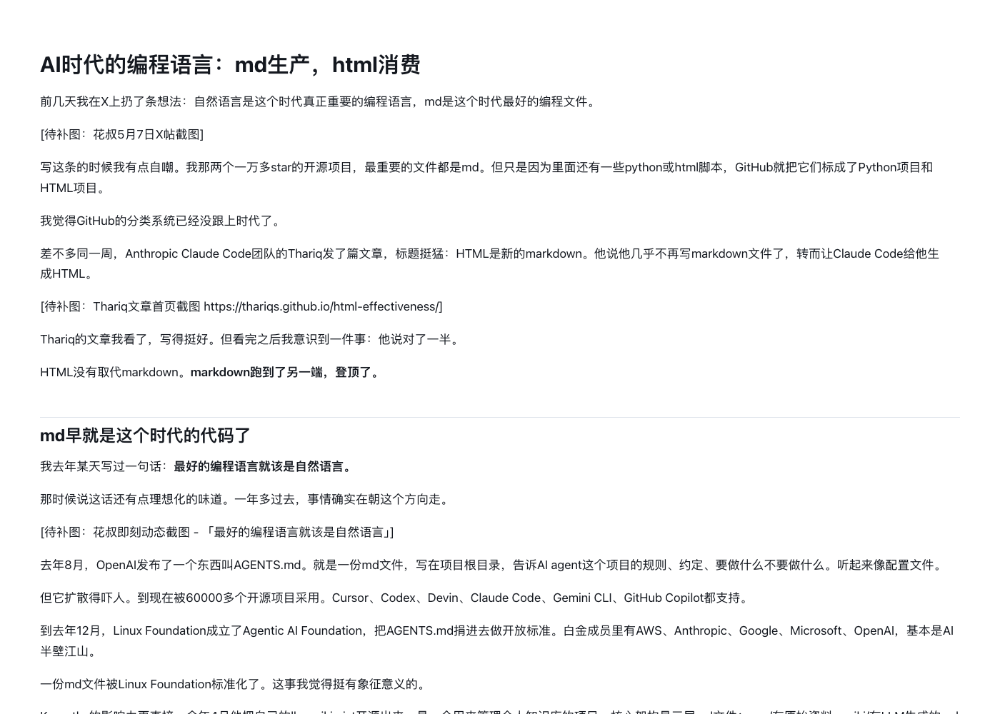
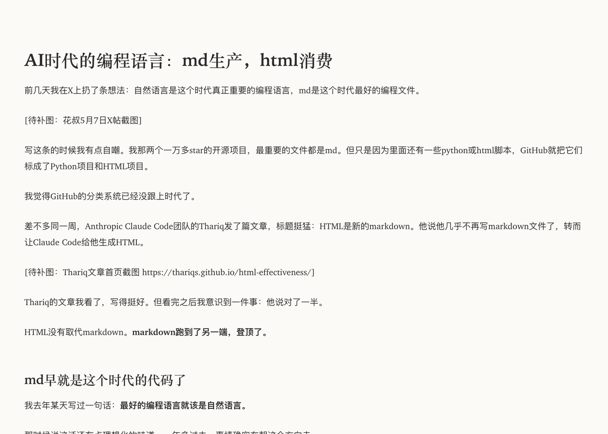
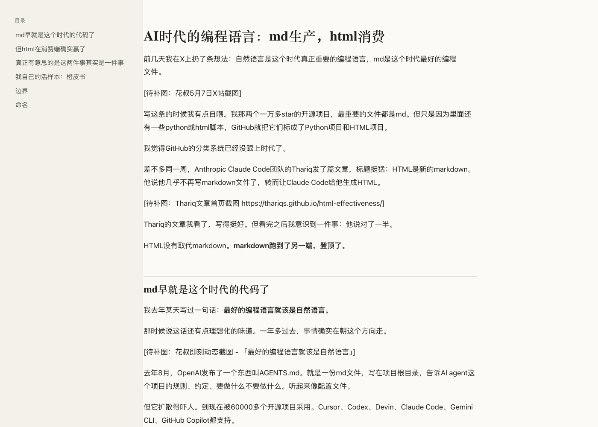

<div align="center">

# huashu-md-html

> *「md 是源代码，html 是产物。」*

[](LICENSE)
[](https://skills.sh)
[](https://skills.sh)

<br>

**md/html 双向流水线 · 三个能力一站式：万物 → md · md → 精美 html · html → md**

<br>

把任意文件（PDF / DOCX / PPTX / XLSX / EPUB / 图片 / 音频 / YouTube / 网页 URL）转成干净的 markdown，再用 4 套精挑过的主题加工成出色的 html，或反过来把已发布的 html 拉回来归档成 md。

每个能力都封装成一个命令，每套主题都过了反 AI slop 检查清单——没有紫渐变、没有 emoji 当图标、没有 `#0D1117` 深蓝底，配色克制，有出版社品位。

```
npx skills add alchaincyf/huashu-md-html
```

跨 agent 通用——Claude Code、Cursor、Codex、OpenClaw、Hermes 都能装。

[看效果](#demo) · [装上就能用](#装上就能用) · [三个能力](#三个能力) · [4 套主题](#4-套主题) · [一条龙工作流](#一条龙工作流)

</div>

---

## Demo

<p align="center">
  
</p>

<p align="center"><sub>
  ▲ 20 秒 · Kenya Hara 极简风格 · md → 入·排·出 → html · 衬线 + 留白 + 一抹赤陶橙<br>
  👉 <a href="demos/v3-hara-hero.mp4">下载 MP4（含 BGM · 850KB）</a>
</sub></p>

<details>
<summary>另一版风格预览（点开看 Pentagram 信息建筑派 · 18 秒）</summary>

<p align="center">
  
</p>

<p align="center"><sub>
  ▲ Pentagram 信息建筑派 · 象牙白 + 墨黑 + 辛辣红 · 大字号 sans + 12 列网格 + tabular nums<br>
  👉 <a href="demos/v1-pentagram.mp4">下载 MP4（含 BGM · 2MB）</a>
</sub></p>

</details>

> 📌 **以上两段动画都是用 [huashu-design](https://github.com/alchaincyf/huashu-design) skill 做的——作为本 skill 的宣传短片。** 同一个产品，两种视觉哲学，差异不来自模板而来自设计语言。

---

## 装上就能用

```bash
npx skills add alchaincyf/huashu-md-html
```

然后在 Claude Code 里直接说话：

```
「这个 PDF 转成 md」
「把这篇 md 做成精美 html，用 article 主题」
「这个博客 URL 转回 md，去掉导航和侧栏」
「把这份 PPTX 转成 md，再用 reading 主题做成发布版」
```

没有按钮、没有面板、没有 GUI。

---

## 三个能力

| 用户说什么 | 能力 | 底层工具 | 入口脚本 |
|---|---|---|---|
| 「PDF / DOCX / PPTX / XLSX / EPUB / 图片 / 音频 / YouTube / 网页 URL → md」 | **能力 1：万物 → md** | [microsoft/markitdown](https://github.com/microsoft/markitdown) | `scripts/any_to_md.py` |
| 「md → 精美 html / 文章 / 报告 / 阅读模式」 | **能力 2：md → 精美 html** | [pandoc](https://pandoc.org/) + 4 套自调主题 | `scripts/md_to_html.py` |
| 「本地 html 或 URL → md / 归档已发布的博客」 | **能力 3：html → md** | [html-to-markdown](https://github.com/Goldziher/html-to-markdown) + [trafilatura](https://github.com/adbar/trafilatura) | `scripts/html_to_md.py` |

**决策原则**：能力 1 产出的 md 可以直接喂给能力 2，组成「PDF → 精美阅读 html」一条龙。能力 3 用于反向归档。

### URL 输入的两条路径

URL 既能走能力 1（markitdown）也能走能力 3（trafilatura），但产出质量差异巨大：

| 页面类型 | 走哪个 | 原因 |
|----------|--------|------|
| **结构化页面**（产品详情、技术文档、API doc、证书页、电商商品页）| 能力 1（markitdown）| 保留 metadata、字段值、链接、标题层级 |
| **正文类页面**（博客、新闻、Essay、长文）| 能力 3（trafilatura）| 自动去导航/侧栏/相关推荐/广告，只留正文 |
| **不确定** | 两个都跑一遍对比 | 看哪个对下游用途更合适 |

**判断捷径**：URL 里的内容是「读」的还是「查」的？读 → 能力 3（去噪），查 → 能力 1（保信息）。

---

## 4 套主题

每套都过了反 AI slop 检查清单。自包含单 CSS，HTML 打开即用，不依赖外部 CDN。

| 主题 | 哲学锚点 | 适合场景 |
|------|---------|---------|
| **article** | Tufte CSS 启发 · Pentagram 式信息建筑 | essay、博客、深度阅读、独立文章 |
| **report** | 出版社白皮书风 · 多表格密度型 | 技术报告、调研、白皮书、产品文档 |
| **reading** | Medium 风极简 · 单栏窄体大字 | 公众号转接、纯阅读、轻量分发 |
| **interactive** | 长文档导航型 · 折叠 + 目录 + 边栏 | 橙皮书章节、技术书籍、长教程 |

<table>
<tr>
<td width="50%"><br><sub><b>article</b> · Tufte 风 · 衬线 + 边距笔记</sub></td>
<td width="50%"><br><sub><b>report</b> · 白皮书风 · 宽体多表格</sub></td>
</tr>
<tr>
<td width="50%"><br><sub><b>reading</b> · Medium 风 · 单栏极简</sub></td>
<td width="50%"><br><sub><b>interactive</b> · 长文档 · 侧边栏 + 折叠目录</sub></td>
</tr>
</table>

### 排版底线（所有主题共享）

```
正文字体（中文）  PingFang SC, Source Han Serif, Noto Serif CJK
正文字体（英文）  Inter, IBM Plex Sans, et-book
代码字体         JetBrains Mono, Fira Code
行高（中文）     1.75 - 1.85
行高（英文）     1.6
字号（桌面）     17 - 18px
最大宽度（文章）  680 - 720px
最大宽度（报告）  760 - 820px
代码块底色       #F6F8FA（浅模式）/ #1F2428（深模式）
引用块           左 4px 色条 + 浅灰底
```

**禁用清单**：紫渐变、赛博霓虹、`#0D1117` 深蓝底、Comic Sans、emoji 作正式图标。

---

## 一条龙工作流

```bash
# 场景 1：PDF 白皮书 → 精美阅读 html
python3 scripts/any_to_md.py whitepaper.pdf -o whitepaper.md
python3 scripts/md_to_html.py whitepaper.md --theme report -o whitepaper.html

# 场景 2：YouTube 视频 → 文章博客
python3 scripts/any_to_md.py "https://youtube.com/watch?v=xxx" -o video.md
# 编辑 video.md...
python3 scripts/md_to_html.py video.md --theme article -o blog.html

# 场景 3：归档已发布的博客文章 → 项目源 md
python3 scripts/html_to_md.py "https://example.com/blog/article" -o article.md

# 场景 4：抓产品页 / 技术文档 → 完整结构化 md
python3 scripts/any_to_md.py "https://learn.microsoft.com/en-us/some-doc" -o doc.md

# 场景 5：橙皮书章节 → 多主题对比
python3 scripts/md_to_html.py chapter.md --theme article -o ch-article.html
python3 scripts/md_to_html.py chapter.md --theme interactive -o ch-interactive.html

# 场景 6：URL 不确定走哪条路 → 两个都跑对比
python3 scripts/any_to_md.py "https://example.com/page" -o page-markitdown.md
python3 scripts/html_to_md.py "https://example.com/page" -o page-trafilatura.md
```

---

## 依赖

| 工具 | 用途 | 安装 |
|------|------|------|
| `markitdown` | 万物 → md | `python3 -m pip install 'markitdown[all]'` |
| `pandoc` | md → html | `brew install pandoc`（macOS）/ [官网下载](https://pandoc.org/installing.html) |
| `html-to-markdown` | html → md（高速 Rust 引擎）| `python3 -m pip install html-to-markdown` |
| `trafilatura` | URL 正文提取 | `python3 -m pip install trafilatura` |

脚本启动时会自检，缺失的依赖会明确提示安装命令，不会静默失败。

> ⚠️ **macOS Python 环境陷阱**：`pip` 和 `python3` 可能指向不同的 Python 版本（实测踩过：`pip` 是 3.11、`python3` 是 3.14）。安装依赖请用 `python3 -m pip install ...`，不要直接 `pip install`。

---

## 仓库结构

```
huashu-md-html/
├── SKILL.md                 # Agent 主文档（中文）
├── README.md                # 本文件
├── scripts/                 # 三能力入口
│   ├── any_to_md.py         # 万物 → md
│   ├── md_to_html.py        # md → 精美 html
│   └── html_to_md.py        # html → md
├── templates/               # 4 套精挑主题 + 公众号专用
│   ├── article/             # Tufte 风
│   ├── report/              # 白皮书风
│   ├── reading/             # Medium 极简
│   ├── interactive/         # 长文档导航
│   └── wechat/              # 公众号转接
├── references/              # 按任务深入文档（中文）
│   ├── markitdown-cookbook.md
│   ├── md-to-html-themes.md
│   ├── html-to-md-cookbook.md
│   ├── design-tokens.md
│   └── anti-ai-slop.md
├── examples/                # 主题预览
│   ├── input/md-vs-html.md
│   └── output/{article,report,reading,interactive}.{html,png}
├── demos/                   # README 引用的宣传动画
│   ├── v3-hara-hero.{gif,mp4}     # Kenya Hara 极简
│   └── v1-pentagram.{gif,mp4}      # Pentagram 信息建筑
└── requirements.txt
```

---

## 设计哲学

这个 skill 的存在源于一个简单观察：**AI 时代，文档的「生产格式」和「消费格式」第一次解耦了。**

写作发生在 markdown——可 diff、AI 友好、版本可控。
分发发生在 html——排版精致、可分享、可导航。
来回切换不应该有成本。

大多数「转 X 到 Y」工具优化的是「转换保真度」。这个 skill 优化的是**写作者的循环**：

- 一份 md 是源——所有创作和编辑都在 md 里
- 多套 html 是产物——按场景挑主题，渲染一份精美的 html
- 来回往返不丢结构——把已发布的博客拉回项目源，或者把别人的好内容归档成 md

继承自 [huashu-design](https://github.com/alchaincyf/huashu-design) 的反 AI slop 审美底线——4 套主题各有一个克制的强调色和一个出版级的排印签名，看起来像出版社做的，不像 SaaS 落地页。

---

## License

MIT License — 个人和商业使用均自由，无需授权。

如果这个 skill 对你有帮助，欢迎 star 仓库；如果你做了有意思的衍生作品（新主题、新格式支持），欢迎 PR。

---

## 联系花叔（Huasheng）

花叔是 AI Native Coder、独立开发者、AI 自媒体博主。代表作：小猫补光灯（App Store 付费榜 Top 1）、《一本书玩转 DeepSeek》、[nuwa-skill](https://github.com/alchaincyf/nuwa-skill)（GitHub 12k+ stars）、[huashu-design](https://github.com/alchaincyf/huashu-design)。全平台累计粉丝 30 万+。

| 平台 | 账号 | 链接 |
|------|------|------|
| X / Twitter | @AlchainHust | https://x.com/AlchainHust |
| 公众号 | 花叔 | 微信搜索「花叔」 |
| B 站 | 花叔 | https://space.bilibili.com/14097567 |
| YouTube | 花叔 | https://www.youtube.com/@Alchain |
| 小红书 | 花叔 | https://www.xiaohongshu.com/user/profile/5abc6f17e8ac2b109179dfdf |
| 官网 | huasheng.ai | https://www.huasheng.ai/ |
| 开发者 Hub | bookai.top | https://bookai.top |

商业合作、内容定制、咨询，请发邮件到 **alchaincyf@gmail.com** 或私信任一社交平台。
